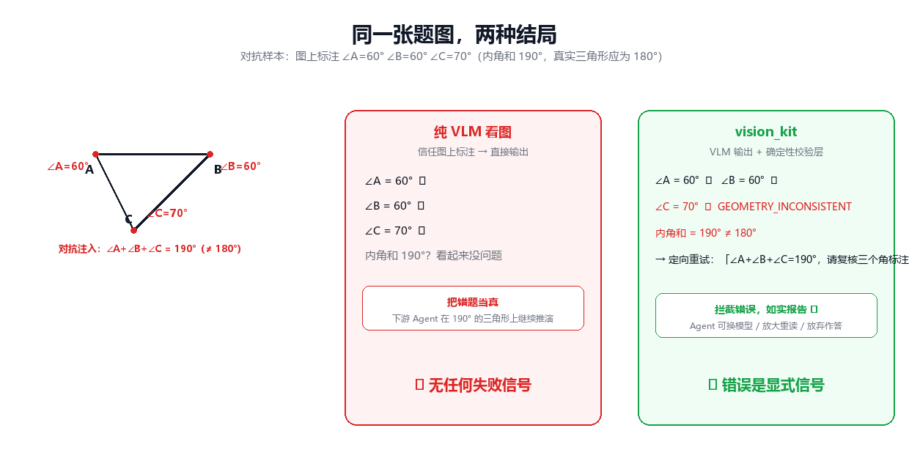
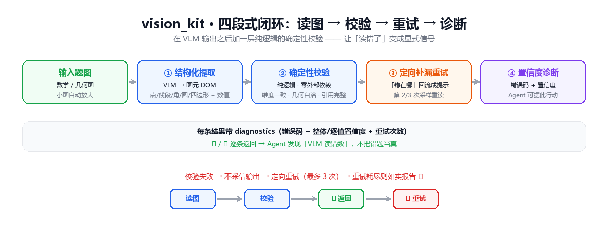
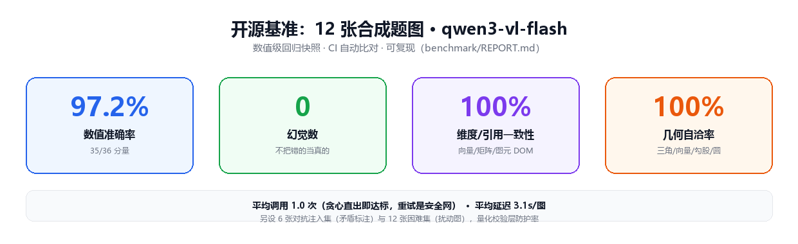

**English** · [简体中文](./README.md)

<div align="center">

# 👁️ vision_kit

**Make your AI agent a math tutor.**

Reading math / geometry diagrams isn't about *seeing* — it's about *seeing correctly*. vision_kit extracts vectors, matrices, coordinates and angles from figures, then verifies the data for dimensional consistency and geometric self-consistency — filling gaps by retry and tiling large images automatically. If the numbers don't add up, you don't get a plausible-looking mistake; you get evidence.

`Python` · `OpenAI-compatible vision` · `MCP` · `DeepSeek Harness` · `opencode`

</div>

---

**It's the vision plugin that actually *verifies*.** Existing plugins just *look* (generic image Q&A). vision_kit adds a **deterministic validation layer** on top of the VLM output:

`triangle angles ≠ 180°` · `vector addition mismatch` · `matrix dimension mismatch` · `negative/out-of-range value`

Any failure triggers a sampling retry; when retries are exhausted, the `✓ / ✗` results are returned to the agent line by line, so it can spot *"the VLM misread the number"* instead of blindly accepting a wrong answer.



> Adversarial sample: the diagram labels ∠A=60° ∠B=60° ∠C=70° (angle sum 190°). A plain VLM trusts the labels and answers; vision_kit's validation layer sees 190° ≠ 180°, returns `✗ GEOMETRY_INCONSISTENT` and retries with a targeted hint — **the mistake becomes an explicit signal**.

---

## Feature overview



| Feature | Description |
| --- | --- |
| **Structured extraction** | Pull vectors / matrices / coordinates / angles / unknowns out of diagram images |
| **Figure DOM** | Typed primitives — points / segments / angles / circles / quadrilaterals (`figures`) with reference-integrity checks (endpoints/vertices/centers/quadrilateral vertices must be defined) |
| **Dimension consistency** | Auto-validate dimensions across related vectors/matrices; auto sample-retry to fill in missed numbers |
| **Geometry self-check** | Triangle angle sum, vector addition, matrix multiplicability, segment length vs. endpoint distance, triangle inequality, Pythagoras, circle theorems (point-on-circle → distance to center = radius; diameter subtends a right angle), similar triangles, parallelogram opposite sides equal, function-graph axis of symmetry, negative/range sanity — pure logic, zero extra dependencies |
| **Targeted gap-filling retry** | The specific rule that failed (dimension / angle sum / vector add / side length …) flows back into a **targeted retry prompt**, so the 2nd/3rd sample re-reads the image knowing *where it went wrong* |
| **Confidence / diagnostics** | Every result carries `diagnostics`: an error code (DIMENSION_MISMATCH / GEOMETRY_INCONSISTENT / NO_NUMERIC_CONTENT …), overall + per-item confidence, and retry count — so the agent can act on the code |
| **Image preprocessing** | Upscale small images for legibility; auto 2×2 overlapping tiling + merge-and-recheck for very large images (cross-tile vector/geometry relations survive); `describe` auto-tiles huge images too |
| **Render-back** | Re-draw the extracted result as PNG (round-trip) for human/model verification of hallucinations |
| **TikZ output** | DOM → compilable LaTeX/TikZ (`--tikz`) so a diagram can be rebuilt for publishing/reuse |
| **Stats → data table** | Bar/line/pie charts → categories + series values with length-alignment, percentage-sum ≈ 100 and non-negative checks (`--mode stats`) |
| **Benchmark + snapshots** | Three `benchmark/` suites — 12 synthetic diagrams (accuracy/recall/hallucination/consistency/geo/retry, `--baseline` quantifies the validation layer) + 6 adversarial-injection diagrams (contradictory annotations → validation-layer protection rate) + 12 hard diagrams (perturbed images → value of gap-filling retry); `tests/snapshots/` numeric regression, auto-compared in CI |
| **Multiple integrations** | One engine, many surfaces: DSH plugin / opencode plugin / MCP / CLI |

---

## 🤏 Which tool: `describe` or `extract`?

The two tools solve different jobs — pick the right one and each shines:

| Scenario | Tool | Why |
| --- | --- | --- |
| **Non-math diagrams** (photos, scenes, flowcharts, electrical/circuit schematics, general image Q&A) | `describe` | Returns natural-language description / answers; generalizes well and never forces a structure that isn't there |
| **Math diagrams with numeric annotations** (vectors / matrices / point coords / angles / lengths / unknowns) | `extract` | Structured extraction + dimension-consistency + geometry self-check — its home turf |
| Want both | `both` | Describe the whole, then extract structure |

**Worth knowing:**
- **`extract` is math-diagram-specific.** It forces vector/matrix/coordinate output. On images with **no such structure** (layout diagrams, UIs, photos), the model may **invent vectors that don't exist** to satisfy the format — use `describe` instead.
- **`describe` doesn't check structure**, so it suits generic viewing, but on precise-number diagrams it won't give you trusted, dimension-checked structured data.
- **How to tell it's a math diagram:** do you need to read *exact sequences of numbers* off the image (vectors, matrices, coords, angles)? Yes → `extract`. No → `describe`.

> Example: on an electrical schematic (black background), `describe` accurately names the three-phase supply, PLC, switches and terminals; running `extract` on it can return **invented fake vectors** because there are no vector/matrix labels — the classic case for "non-math diagram → use `describe`".

---

## Why vision_kit?

| Plugin / Project | Focus | Where vision_kit differs |
| --- | --- | --- |
| `dsh-vision` (view_image) | Generic image Q&A | ✅ Only one producing **structured math/geometry output** |
| `dsh-tool-see-image` (see_image) | Generic description | ✅ Has dimension checks, geo checks, gap-filling retry |
| `dsh-plugin-deepeye` | Generic image Q&A | ✅ Adds deterministic self-consistency, not just prose |
| `dsh-vision-toolkit` | OCR / UI reconstruction | ✅ Targets math annotations and validates value sanity |

> **In one line:** the *"read a diagram + verify geometry"* combo is unique. vision_kit puts validation **after the VLM output** —
> pure logic, unit-testable, benchmarkable, and independent of any specific vision model.

---

## 📊 Benchmark (12 synthetic diagrams · `qwen3-vl-flash`)



First published run ([`benchmark/REPORT.md`](benchmark/REPORT.md), reproducible):

| Metric | Value |
| --- | --- |
| Numeric accuracy | **97.2%** (35/36 components) |
| Recall | 10/10 labels |
| Hallucinations | **0** |
| Dimension/reference consistency | 100% |
| Geometry self-consistency | 100% |
| Avg. model calls | 1.0 (no retries needed) |
| Avg. latency | 3.1s/image |

> The only imperfect row (`tri_sides_01`) is a slight vertex-coordinate reading drift that still passes every
> geometry check (within tolerance) — the layer never flags a correct reading as wrong.
> `--baseline` compares single-shot greedy output vs. the validated+retried pipeline; on this simple synthetic set
> the deterministic layer is a **safety net** (never trust a hallucination) rather than a score booster —
> retries pay off on harder, dense/noisy real-world diagrams.

---

## First time? Confirm these

**1. Get a vision-model key (Alibaba Cloud Bailian / DashScope)**
The recommended model `qwen3-vl-flash` comes from **Alibaba Cloud Bailian**. Go to [dashscope.console.aliyun.com](https://dashscope.console.aliyun.com) → sign in/register → enable Bailian → create an **API Key** (`SK-` prefix). Every integration (CLI / MCP / plugin) uses this same key.

**2. Which integration to try first?**
- **Want to see results fast → use the CLI** (one command, instant JSON).
- **Want your opencode agent to see images → use the opencode plugin** (recommended for developers).
- **Want to call it from your own Python script → use Quickstart (Python API)**.

Below is ordered CLI → opencode plugin → DSH plugin. Jump to the section you need.

**3. Which directory?**
The repo root *is* the package root (see `package-dir` in `pyproject.toml`). **Run commands and place images in the cloned repo root** so `python -m vision_kit.*` and `test_figure.png` resolve.

---

## Quickstart (Python)

> 💡 **Recommended vision model: `qwen3-vl-flash`** — a lightweight multimodal model from Alibaba Cloud Bailian (DashScope),
> stable on Chinese math/geometry figure annotations, good speed-to-cost. vision_kit calls via the **OpenAI-compatible protocol**,
> so you configure it through env vars — no code changes needed.
> Prefer Zhipu's `glm-4v-flash`? Set `VISION_API_BASE` to `https://open.bigmodel.cn/api/paas/v4` and `VISION_MODEL` to `glm-4v-flash`,
> **and remember to set `VISION_MAX_TOKENS` back to `1024`** (glm-4v-flash's cap is 1024 — see "Tuning parameters" below).
> Examples below default to the DashScope (Bailian) compatible endpoint.

```bash
# Run from the repo root after cloning
pip install -e .            # installs openai / pillow / mcp
export VISION_API_KEY=your_key    # the SK- key from Alibaba Cloud Bailian
# The two below are optional defaults (official DashScope endpoint + qwen3-vl-flash); safe to omit:
export VISION_API_BASE=https://dashscope.aliyuncs.com/compatible-mode/v1   # optional
export VISION_MODEL=qwen3-vl-flash                                        # optional
```

```python
from vision_kit import VisionClient

client = VisionClient(api_base="https://dashscope.aliyuncs.com/compatible-mode/v1",
                      api_key="your_key", model="qwen3-vl-flash")
text = client.describe("problem_figure.png")            # rendered text (for LLM injection)
data = client.describe_structured("problem_figure.png") # structured dict
```

### Do you need to `pip install`?

vision_kit **maps the repo root to the package root** (`pyproject.toml` → `package-dir: vision_kit = "."`).
Two ways to use it — pick one:

- **Recommended (easiest for CLI/MCP):** `pip install -e .` once, then `python -m vision_kit.*` works from anywhere.
- **No install needed:** add the repo directory to `PYTHONPATH` and `import vision_kit` directly (that's how the DSH plugin's `visionKitDir` works).

**Pick either one — don't do both.** If you neither install nor set `PYTHONPATH`, `python -m vision_kit.cli` will report "No module named".

---

## Command Line (for plugins / scripts)

```bash
python -m vision_kit.cli problem_figure.png --mode describe   # natural-language description / Q&A
python -m vision_kit.cli problem_figure.png --mode extract    # structured extraction (JSON)
python -m vision_kit.cli problem_figure.png --mode both
python -m vision_kit.cli chart.png --mode stats               # stats chart → data table (categories/series)
python -m vision_kit.cli figure.png --mode extract --type geometry   # figure-type prompt template
python -m vision_kit.cli figure.png --mode extract --tikz            # also emit compilable TikZ
# after pip install: vision-kit-cli problem_figure.png --mode extract
```

Output is one line of JSON: `{"ok": true, "mode": "extract", "result": {...}}`; on failure `{"ok": false, "error": "..."}` with exit code 1.
Credentials come from env vars `VISION_API_KEY / VISION_API_BASE / VISION_MODEL / VISION_TIMEOUT / VISION_MAX_TOKENS` (same as the MCP server).

### Quickest way to verify

```bash
# From the repo root (so the bundled test_figure.png is found)
python -m vision_kit.cli test_figure.png --mode extract
```

> Note: `test_figure.png` ships with this repo. **When you use a global plugin / run from your own project, that file isn't in your workspace** —
> use your own image path, or `cd` to the repo root first. Image paths resolve against the **current working directory**.

---

## opencode vision plugin (recommended)

Give a coding agent "eyes": no need to switch to a multimodal model — any text-only model can see images.

### Two tools

| Tool | Purpose |
| --- | --- |
| `vision_describe` | Look at an image, return a description, or answer **specific questions** about it (pass `prompt`) |
| `vision_extract` | **Structured** extraction of numeric annotations — vectors / matrices / coordinates / angles, with dimension checks + gap-filling retry |

### Install

The plugin is a JS file placed in the plugin directory; opencode loads it at startup (no config change):

```bash
# Prereq: clone this repo and use its .opencode/plugins/vision-kit.js

# Project-level (only the project it's added to): create the target plugin dir first if missing
mkdir -p <your-project>/.opencode/plugins
cp .opencode/plugins/vision-kit.js <your-project>/.opencode/plugins/

# Global (all projects):
mkdir -p ~/.config/opencode/plugins
cp .opencode/plugins/vision-kit.js ~/.config/opencode/plugins/
```

> The `cp` above runs from the **repo root**. Want just the plugin, not the whole library? Copy that single file —
> the plugin calls `python -m vision_kit.cli`, so the target machine still needs to `import vision_kit` (see "Do you need to pip install").

### Credentials (priority)

1. Env vars `VISION_API_KEY` / `VISION_API_BASE` / `VISION_MODEL` / …
2. opencode config `mcp["vision-kit"].env` (global `~/.config/opencode/opencode.json` or project `.opencode/opencode.json`, as in [opencode.example.json](opencode.example.json))

No need to repeat the key: as long as your opencode config has the vision-kit MCP, the plugin reuses the same credentials.

> **Where does the key go? One clean table:**

| You're using | Configure here | Notes |
| --- | --- | --- |
| opencode **plugin** | `VISION_API_KEY` in opencode config `mcp["vision-kit"].env` | Reused automatically, simplest |
| **CLI / MCP server** | env var `VISION_API_KEY` (or opencode.json env) | `export` it, or set it in env |
| **DSH plugin** | `apiKey` in `vision.config.json` | see DSH section below |

One key across the three spots — you don't have to fill all of them; configure only the one for the integration you use.

### How it works

The plugin implements no vision logic itself: it calls `python -m vision_kit.cli` and fully reuses this project's image preprocessing, structured extraction, dimension checks, gap-filling retry, and large-image tiling. The plugin only handles path resolution (relative paths resolve against the session directory), credential injection, and result formatting.

### Try it

```bash
opencode run "use vision_describe on test_figure.png and tell me which vectors are in it"
opencode run "use vision_extract to extract structured data from test_figure.png"
```

`test_figure.png` is the bundled vector-problem example, **in the repo root**.
When running with a global plugin / from another workspace, use an absolute path to your own image.

---

## opencode MCP server

```bash
python -m vision_kit.mcp_server   # after pip install: vision-kit-mcp
```

Wire it into opencode via [opencode.example.json](opencode.example.json) (DashScope qwen3-vl-flash example).

---

## DeepSeek Harness vision plugin

The DSH **fixed** Cordis plugin ([dsh-plugin/vision-kit.dsh.js](dsh-plugin/vision-kit.dsh.js)) is the same source as the opencode one.
It gives any text-only DSH model "eyes": registers `vision_describe` / `vision_extract`, and reuses all of vision_kit's vision logic through `python -m vision_kit.cli`.
`vision_extract` additionally returns the **geometry self-check** results (`geo_checks`) to the model — triangle angle sum, vector-add relations, matrix dimensions, negatives, etc.
Any failure triggers a sampling retry; when retries are exhausted, each `✗ failed` line is shown, so the text agent can notice "the reading contradicts itself" instead of trusting it blindly.

### First-time setup (required)

The DSH plugin reads vision credentials from `vision.config.json` at the repo root. For security, **this file isn't distributed** — you create your own:

```bash
# From the repo root
cp vision.config.example.json vision.config.json
# then edit vision.config.json:
#   apiKey      — your SK- key from Alibaba Cloud Bailian (required)
#   python      — (recommended) absolute path to your python.exe
#   visionKitDir— absolute path to this repo root (used to locate cli.py and vision.config.json)
```

- The template [vision.config.example.json](vision.config.example.json) contains no secrets and is safe to use as a reference.
- ⚠️ `vision.config.json` holds your API key — treat it as private, don't share or upload it.
- The plugin **locates the project directory automatically**: it checks the `VISION_KIT_DIR` env var first, then derives it from the plugin file's own location
  (this file lives at `<repo-root>/dsh-plugin/vision-kit.dsh.js`, so the repo root is its parent directory), and finally probes the current working directory;
  if it still can't find it, it errors and guides you to set `visionKitDir`.

### Install & enable (fixed plugin, survives restart)

The plugin is now a **DSH fixed plugin**: written as an `insert` line into `$DSH_HOME/profiles/web/cordis.patch.yml`,
it auto-mounts when the DSH Web deployment starts and **survives restarts** — no need to `cordis_define` it again each time:

```yaml
# $DSH_HOME/profiles/web/cordis.patch.yml
- insert:
    - id: vision_kit
      name: 'file:///D:/libs/vision_kit/dsh-plugin/vision-kit.dsh.js'
```

- `name` must be a `file://` URL: a raw Windows path (`D:\...`) is rejected by the Node ESM loader as a `d:` scheme.
- The plugin file is a CommonJS module (`module.exports`); tools are registered globally via `ctx.tools.register(...)`,
  so all sessions can use them right after mounting (new sessions immediately; already-open ones see them after the next start).
- The equivalent manual overlay lives in [dsh-plugin/cordis.yml](dsh-plugin/cordis.yml) (for `dsh web --patch`).
- After editing plugin code, restart `dsh web` (editing the patch file itself triggers hot reload).

### Paths

`image_path` accepts relative paths (resolved against the caller's session workspace) or absolute paths.

### Which model calibrated the sample (important)

The `test_figure.png` results shown throughout this README were calibrated with the **default model `qwen3-vl-flash`** (DashScope).
Different vision models may extract slightly different values from the same image — expected when you switch to glm or others.

### Try it

```text
use vision_describe on test_figure.png and tell me which vectors are in it
use vision_extract to extract structured data from test_figure.png
```

> `test_figure.png` lives in the repo root. When using a global plugin / elsewhere, point to your own image's absolute path.

---

## Environment variables

| Variable | Required | Default |
| --- | --- | --- |
| `VISION_API_KEY` | yes | - |
| `VISION_API_BASE` | no | `https://dashscope.aliyuncs.com/compatible-mode/v1` |
| `VISION_MODEL` | no | `qwen3-vl-flash` |
| `VISION_TIMEOUT` | no | `60` |
| `VISION_MAX_TOKENS` | no | `8192` (qwen3-vl-flash cap) |
| `VISION_KIT_DIR` | no | none. DSH plugin project dir for `PYTHONPATH`; the plugin reads it first to locate the project, else auto-probes / guides via template |

### Tuning parameters

The env vars and engine constants ship with sensible defaults — **most setups need no changes**. Fine-tune only if you have specific needs:

**About max_tokens**
- The default `8192` is `qwen3-vl-flash`'s **cap**. Structured vision output is usually a **short JSON** (vectors/matrices/notes),
  often only a few hundred to a couple thousand tokens — so lowering to `1024~2048` rarely truncates and trims cost a little.
- Returning a **large matrix** or an image with **lots of text**? Keep `8192` to avoid truncation; go above only if needed.
- ⚠️ **Always adjust this when switching models**: defaults track qwen3-vl-flash (cap 8192).
  Switch to Zhipu's `glm-4v-flash` and its cap is **only 1024** — using 8192 errors with "parameter exceeds limit". Set `VISION_MAX_TOKENS=1024`.

**By goal**

| Goal | Suggested change | Why |
| --- | --- | --- |
| More accurate (ok with slower) | `VISION_TIMEOUT` up, e.g. `120` | Preprocessing + retries + tiling can be slow; a tight timeout may false-fail |
| Cheaper | `VISION_MAX_TOKENS` to `1024~2048` | Structured output is usually plenty; avoids wasted tokens |
| Very small/dense images | Raise `MIN_DIM` in engine.py (default `1000`) | More aggressive upscale → crisper digits |
| Very large images (tiled) | Lower `MAX_TILE_SIDE` (default `1600`) | Smaller tiles lighten per-model load but increase count/overhead |
| More thorough gap-filling | Raise `MAX_ATTEMPTS` (default `3`) | More retries when validation fails; stabler yet slower |

> Env vars (`VISION_*`) are set via **CLI / MCP / opencode plugin env** — no code change needed.
> Engine constants (`MIN_DIM` / `MAX_TILE_SIDE` / `MAX_ATTEMPTS`, etc.) are at the top of `engine.py`; edit then re-run.

---

## Development

```bash
pip install -e ".[dev]"
pytest              # unit tests (tests/)
ruff check .        # linting

# Benchmark: regenerate the diagrams (deterministic, no API needed)
python benchmark/generate_images.py          # main + adversarial + hard suites
# Run evaluation (needs VISION_API_KEY): per-image metrics + REPORT leaderboard
python benchmark/eval.py --limit 3           # quick smoke run
python benchmark/eval.py                     # full main suite → REPORT.md
python benchmark/eval.py --subset adv        # adversarial suite → REPORT_ADV.md (validation-layer protection rate)
python benchmark/eval.py --subset hard       # hard suite → REPORT_HARD.md (gap-filling retry value under perturbation)
python benchmark/eval.py --baseline          # also run the single-shot greedy baseline to quantify the validation-layer gain
# Regression snapshots: record/compare real-model output baselines (needs VISION_API_KEY)
python benchmark/eval.py --update-snapshots
pytest tests/test_snapshots.py               # numeric-level regression (auto-skipped offline)
```

## Project structure

```
vision_kit/
├── __init__.py       # package entry, exports VisionClient (__version__ = 0.3.0)
├── client.py         # VisionClient: upscale preprocess / structured / tiled merge-recheck / targeted retry / render-back / content-addressed cache
├── engine.py         # recognition engine: prompts, parameterized calls, targeted retry (failed rule → hint), tiled merge-recheck for huge images
├── figure.py         # FigureData: figure DOM (incl. on-circle points / quadrilaterals) + vector/matrix parse + dimension/reference checks + geo checks + tiled merge + render-back + TikZ
├── geometry.py       # geometric self-check: triangle sum / vector add / matrix dims / segment length / triangle inequality / Pythagoras / circle theorems / similar triangles / parallelogram / function symmetry / negatives (pure logic)
├── stats.py          # stats chart → data table (4.3): categories/series + alignment / percent-sum / non-negative checks + retry
├── prompts.py        # scenario prompt templates (4.1): geometry / function / vector / statistics
├── cli.py            # command-line JSON entry (--mode describe|extract|both|render|stats, --type/--tikz/--render)
├── mcp_server.py     # opencode MCP server (stdio; describe_image / structured / stats)
├── benchmark/        # 2.1 benchmark: synthetic + adversarial + hard suites + ground_truth* + eval.py (--subset/--baseline; produces REPORT*.md)
├── tests/snapshots/  # 2.4 regression snapshot baselines (real model output, numeric comparison)
├── opencode.example.json
├── vision.config.example.json   # DSH plugin config template (no key, ready to use)
├── vision.config.json           # local vision credentials (copied from template; not distributed)
├── .gitignore          # excludes vision.config.json and other local files
├── dsh-plugin/
│   ├── vision-kit.dsh.js       # DeepSeek Harness fixed vision plugin (CommonJS module)
│   └── cordis.yml              # equivalent overlay (for `dsh web --patch`; fixed install lives in $DSH_HOME/profiles/web/cordis.patch.yml)
└── .opencode/
    └── plugins/vision-kit.js   # opencode vision plugin (see above)
```
